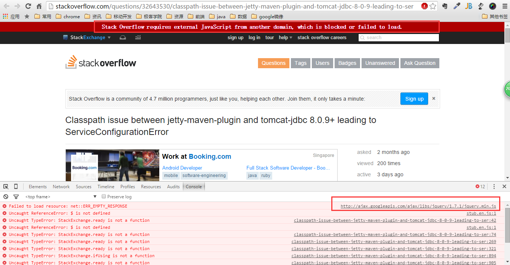

LocalCDN
----
build your onw local cdn to access website fast!

构建自己本地的CDN来提高网站的访问速度

[开发手册](https://github.com/gefangshuai/LocalCDN/wiki)

# 已添加的资源列表(欢迎提供资源，持续更新！)
- 127.0.0.1 ajax.googleapis.com

# How to use
## 1. 将项目clone下来
```bash
git clone git@github.com:gefangshuai/LocalCDN.git
```
## 2 双击startup.bat运行

## 3. 修改本地host文件

进到`C:\Windows\System32\drivers\etc`目录下，打开`hosts`文件，将`LocalCDN/build/hosts.txt`中的内容，复制到你自己的hosts文件中

## 4. 关闭服务

双击`stop.bat`

over！

## 3. 刷新dns缓存（非必须，如果发现没起作用，再操作）

```bash
ipconfig /flushdns
```

## 原理解析
这几天在上[http://stackoverflow.com/](stackoverflow.com)的时候，访问速度巨慢！浏览器debug发现是由于此站jquery用的是`ajax.googleapis.com`上的资源，而google已经被拒之墙外了，所以这个js一直请求不来，就造成了访问速度超级慢(说到这里又想说脏话了，唉！)！



通过本地搭建一个web容器，将资源文件的相对路径跟`ajax.googleapis.com`对应起来，然后将`127.0.0.1`指向`ajax.googleapis.com`。

这样当网站请求`http://ajax.googleapis.com/ajax/libs/jquery/1.7.1/jquery.min.js`时，实际上走的是`http://127.0.0.1/ajax/libs/jquery/1.7.1/jquery.min.js`，从本地加载速度当然就上来了！

## 后续
本项目刚起步，所以还不成熟，后续的发展希望越来越多的开源精神的人加进来，提供静态资源，丰富本地cdn，造福更多的人更多的需求！

[开发手册](https://github.com/gefangshuai/LocalCDN/wiki)